## Typora画图

### 一、流程图

#### 1、图形

- 声明流程图

通过`graph`声明一个流程图，并定义流程图的方向。

```cwp
graph LR;
	左 --> 右
```

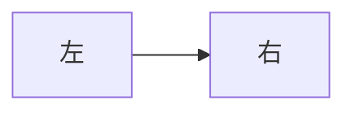

- 定义方向

可定义的防线分为以下五种

```cwp
TB：从上到下
TD：与TB相同，从上到下
BT：从下到上
LR：从左到右
RL：从右到左

其中T=top，B=bottom，D=down，L=left，R=right
```

- 接下来实现一个简单的流程图

```cwp
graph TD
  A-->B
  A-->C
  B-->D
  C-->D
```

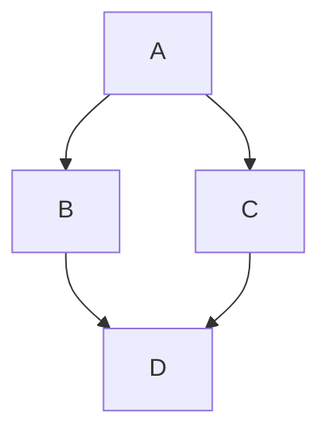

#### 2、节点和形状

##### (1) 矩形（默认）

```cwp
graph LR
    id[ddd]
```

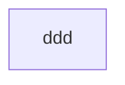

##### (2) 圆角矩形

```cwp
graph LR
    id(ddd)
```

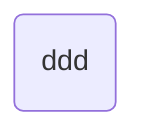

##### (3) 圆形

```cwp
graph LR
	id((sss))
```

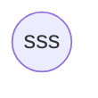

##### (4) 非对称形状

```cwp
graph LR
    id>This is the text in the box]
```


##### (5) 菱形

```cwp
graph LR
    id{This is the text in the box}
```

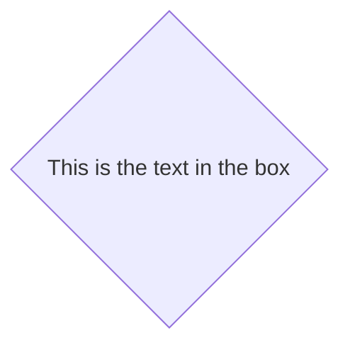

##### (6) 六角形

```cwp
graph LR
    id1{{This is the text in the box}}
```


##### (7) 平行四边形

```cwp
graph TD
    id1[/This is the text in the box/]
```

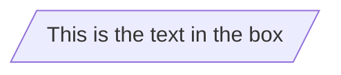

##### (8) 反平行四边形

```cwp
graph TD
    id1[\This is the text in the box\]
```

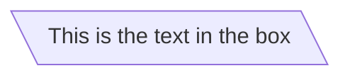

##### (9) 梯形

```cwp
graph TD
	A[/梯形\]
```

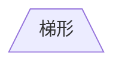

##### (10) 梯形alt

```cwp
graph TD
    B[\Go shopping/]
```

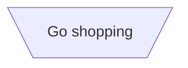

#### 3、节点之间的连接

##### (1) 箭头

```cwp
graph LR
	A --> B
```


##### (2) 直线

```cwp
graph LR
A --- B
```

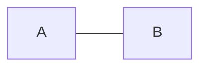

##### (3) 连接上的文字

```cwp
graph LR
	A ---|联系|B
```

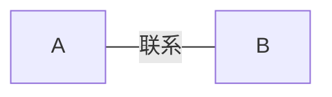

或者

```cwp
graph LR
	A -- 联系 ---B
```


##### (4) 虚线

```cwp
graph LR
	A -.-> B
```


#### 4、学习路线

##### (1) mermaid流程图

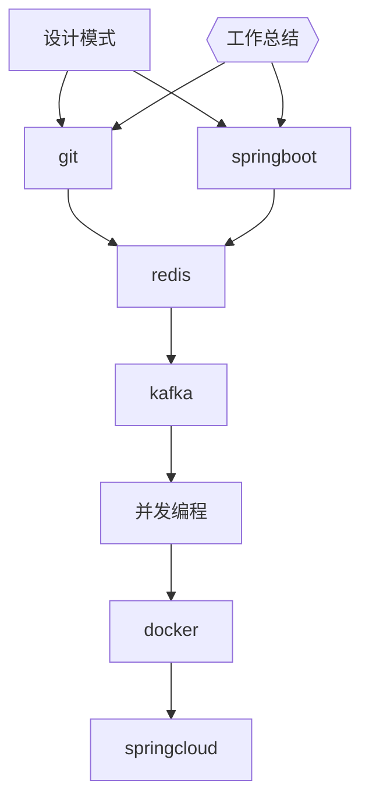

##### (2) 标准流程图

```cwp
st=>start: 开始
op=>operation: 处理框
cond=>condition: 判断框(是或否?)
sub1=>subroutine: 子流程
io=>inputoutput: 输入输出框
e=>end: 结束

st->op->cond
cond(yes)->io(bottom)->e
cond(no)->sub1(right)->op
```

```flow
st=>start: 开始
op=>operation: 处理框
cond=>condition: 判断框(是或否?)
sub1=>subroutine: 子流程
io=>inputoutput: 输入输出框
e=>end: 结束

st->op->cond
cond(yes)->io(bottom)->e
cond(no)->sub1(right)->op
```

#### 5、练习

##### (1) 快桩PC架构图

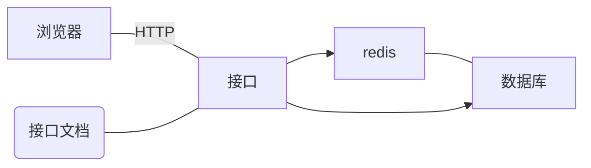

