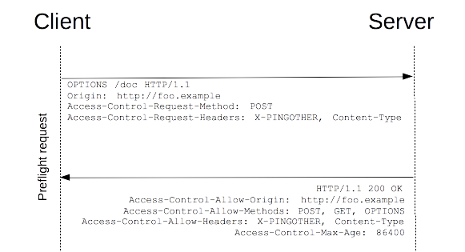
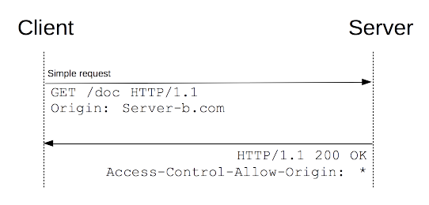
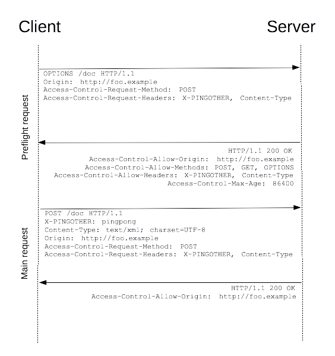
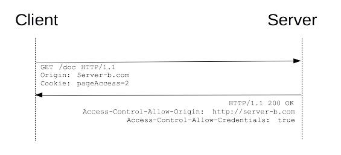

## 工作重遇到的问题及我的解决方案

### 工作中的问题

#### 一. 跨域请求

##### 1. 问题描述

> 跨域是指一个域下的文档或脚本试图去请求另一个域下的资源，这里跨域是广义的。通常所说的跨域是狭义的，是由浏览器同源策略限制的一类请求场景。从一个域名的网页去请求另一个域名的资源时，域名、端口、协议任一不同，都是跨域。

##### 2. 解决方案

```java
/*
	1. 这里采用CORS的方式解决跨域问题
	2. 推荐使用第三种方法，将跨域拦截器添加到项目中然后最先增加到拦截器中即可。
	
 */
```

- 方法一：通过@CrossOrigin注解实现跨域

  ```properties
  使用时需要在每个controller类上配置@CrossOrigin注解。注解参数解释如下：

  origins:访问接口的源。用人话说就是前端调用接口，那源就是进入前端项目的URL中的（协议://域名:端口）
  allowCredentials:是否允许附带身份凭证和cookies。推荐设置为true,需注意的是如果设置为true,那		origins就必须指定为具体的源
  maxAge:设置预检请求的有效时间。
  methods:设置实际请求允许的HTTP方法。默认与接口规定的方法一致。
  exposedHeaders: 设置出了基本的响应头之外允许浏览器解析的响应头
  ```

  ```java
  package frost2.dailyquestion.crossdomain;

  import org.springframework.web.bind.annotation.CrossOrigin;
  import org.springframework.web.bind.annotation.GetMapping;
  import org.springframework.web.bind.annotation.RequestMapping;
  import org.springframework.web.bind.annotation.RestController;

  @CrossOrigin(
          origins = "http://localhost:8080",
          allowCredentials = "true",
          exposedHeaders = "基本的响应头之外,允许浏览器访问的响应头",
          maxAge = 1800
  )
  @RestController
  @RequestMapping("/frost2")
  public class CrossOriginDemo {

      //必须规定HTTP方法，否则跨域配置可能不生效
      @GetMapping("/dailyquestion")
      public String test(){
          return "frost2";
      }
  }

  ```

- 方法二：通过实现WebMvcConfigurer重写addCorsMappings方法

  ```properties
  增加一个配置类即可，其他地方不同做任何改变，不用像使用注解那样每个类都需要配置.

  **注意**: 这种方法和第三种使用拦截器不兼容。如果同时重写了addCorsMappings并且配置了其他的拦截器，例如登录拦截，那么就会导致跨域配置失败，解决办法就是采用拦截器配置跨域，然后让跨域拦截器最先执行。见第三种方法。
  ```

  ```java
  package frost2.dailyquestion.crossdomain;

  import org.springframework.web.servlet.config.annotation.CorsRegistry;
  import org.springframework.web.servlet.config.annotation.WebMvcConfigurer;

  @Configuration
  public class WebMvcConfigurerDemo implements WebMvcConfigurer {

      @Override
      public void addCorsMappings(CorsRegistry registry) {
          registry.addMapping("/**")
              .allowedOrigins("http://localhost:8080")
              .allowedHeaders("custom-header")   //允许前端携带的请求头,有自定义请求头就写进去
              .allowedMethods("*")               //允许前端请求的方法，"*"表示所有
              .allowCredentials(true)
              .maxAge(1800)
              .exposedHeaders("custom-header"); //允许浏览器访问的响应头,有自定义响应头就写进去

      }
  }
  ```

- 方法三：通过springboot的拦截器  --  实现WebMvcConfigurer重写addInterceptors方法

  ```properties
  配置拦截器: 同样是实现WebMvcConfigurer接口，但实现的方法为addInterceptors

  **注意**: 如果你的项目不用拦截器你那么方法二、均可，但是如果你的项已经使用了拦截器或者将会使用拦截器，那么将跨域拦截器首先添加，让跨配置最先生效这样对你的项目就不会有什么影响
  ```
  
  ```java
  package com.yjzn.customization.common.intercept;
  
  import org.springframework.stereotype.Component;
  import org.springframework.web.servlet.handler.HandlerInterceptorAdapter;
  import javax.servlet.http.HttpServletRequest;
  import javax.servlet.http.HttpServletResponse;
  
  /**
   * 跨域配置
   * @author 陈伟平
   * @date 2019年12月19日15:19:20
   */
  @Component
  public class CORSInterceptor extends HandlerInterceptorAdapter {
  
      public boolean preHandle(HttpServletRequest request, HttpServletResponse response, Object handler){
  
          response.setHeader("Access-Control-Allow-Origin", "http://localhost:8080");
          response.setHeader("Access-Control-Allow-Methods", "GET,POST,PUT,DELETE,OPTIONS");
          response.setHeader("Access-Control-Allow-Headers", "Content-Type,自定义请求头");
          response.setHeader("Access-Control-Allow-Credentials", "true");
          response.setHeader("Access-Control-Expose-Headers", "customResponse,自定义响应头");
  
          //预检请求返回
          if (request.getMethod().equals("OPTIONS")){
              response.setStatus(200);
              return false;
          }
          return true;
      }
  
  }
  ```
  
  ```java
  package com.yjzn.customization.config;
  
  import com.yjzn.customization.common.intercept.CORSInterceptor;
  import com.yjzn.customization.common.intercept.PrivilegeInterceptor;
  import org.springframework.beans.factory.annotation.Autowired;
  import org.springframework.context.annotation.Configuration;
  import org.springframework.web.servlet.config.annotation.InterceptorRegistry;
  import org.springframework.web.servlet.config.annotation.WebMvcConfigurer;
  
  import java.text.SimpleDateFormat;
  
  /**
   *
   * @author 陈伟平
   * @date 2019年12月19日15:36:58
   */
  @Configuration
  public class InterceptorConfig implements WebMvcConfigurer {
  
      @Autowired
      private CORSInterceptor corsInterceptor;
      @Autowired
      private PrivilegeInterceptor privilegeInterceptor;
  
      @Override
      public void addInterceptors(InterceptorRegistry registry) {
          /*
                  先注册拦截器，优先级高
               */
          registry.addInterceptor(corsInterceptor)
              .addPathPatterns("/**");
  
          registry.addInterceptor(privilegeInterceptor)
              .addPathPatterns("/**")
              .excludePathPatterns("/admin/login")
              .excludePathPatterns("/swagger-resources/**", 
                                   "/webjars/**", "/v2/**", 
                                   "/swagger-ui.html/**") //不拦截swagger-ui
              .excludePathPatterns("/statistics/**");
  
      }
  
  }
  ```

##### 3. 相关知识

- 浏览器同源策略

  - ###### 什么是源？

    ```cwp
    协议://域名:端口 他们三者的组合就是一个源。

    同源即为两个URL他们的协议域名端口完全相同，有一个不同即为不同源。
    并且http://localhost:8080与http://127.0.0.1:8080也属于不同源。

    IE浏览器没有将端口号加入到同源策略的组成部分之中，即http://localhost:8080与http://localhost:8081为同源，不受任何限制。
    ```

  - ###### 什么是同源策略？

    > **同源策略**限制了从同一个源加载的文档或脚本如何与来自另一个源的资源进行交互。这是一个用于隔离潜在恶意文件的重要安全机制。

    ```cwp
    这是是在MDN(Mozilla Developer Network)给出的定义。
    对于这句话我的理解为：同源策略就是一种安全机制，他限制了从同一个源加载的文档或脚本如何与来自另一个源的资源进行交互。
    ```

  - ###### 为什么需要同源策略？

    > 浏览器是从两个方面去做这个同源策略的，一是针对接口的请求，二是针对Dom的查询。

    ```cwp
    这一部分我了解不深，可以参考下面两篇文章，目前我知道如果没有同源策略那么就能够实现跨站请求伪造(CSRF),他会导致你的个人隐私泄露以及财产损失。
    ```

    [不要再问我跨域的问题了](https://segmentfault.com/a/1190000015597029)     [浅析CSRF攻击](https://www.cnblogs.com/hyddd/archive/2009/04/09/1432744.html)


- CORS(跨域资源共享)  --  Cross-Origin Resource Sharing

  - ###### 什么是CORS？

    > CORS是一种机制，它使用额外的HTTP头来告诉浏览器让运行在一个 origin (domain) 上的Web应用被准许访问来自不同源服务器上的指定的资源。

    ```cwp
    	也就是说一个web应用可以通过设置额外的HTTP头来描述哪些源可以从我这里读取资源。以此来实现处理跨域请求。
    	至于是哪些请求头会面会有总结。
    ```

  - ###### CORS功能

    > 跨域资源共享标准新增了一组 HTTP 首部字段，允许服务器声明哪些源站通过浏览器有权限访问哪些资源。另外，规范要求，对那些可能对服务器数据产生副作用的 HTTP 请求方法（特别是 [`GET`](https://developer.mozilla.org/zh-CN/docs/Web/HTTP/Methods/GET) 以外的 HTTP 请求，或者搭配某些 MIME 类型的 [`POST`](https://developer.mozilla.org/zh-CN/docs/Web/HTTP/Methods/POST) 请求），浏览器必须首先使用 [`OPTIONS`](https://developer.mozilla.org/zh-CN/docs/Web/HTTP/Methods/OPTIONS) 方法发起一个预检请求（preflight request），从而获知服务端是否允许该跨域请求。服务器确认允许之后，才发起实际的 HTTP 请求。在预检请求的返回中，服务器端也可以通知客户端，是否需要携带身份凭证（包括 [Cookies ](https://developer.mozilla.org/zh-CN/docs/Web/HTTP/Cookies)和 HTTP 认证相关数据）。

    ```cwp
    CORS如果请求失败，代码层面是不知道的，只有通过浏览器的控制台去查看。
    ```

  - ###### CORS请求分类

    ```cwp
    其实CORS请求是没有分类的。只不过其中一些请求会触发预检请求(prefilght request)，另一些请求不会触发预检请求，所以人们分别将他们称为非简单请求和简单请求，也就有了分类这么一说。
    ```

    故关键点就在于哪些请求会触发预检请求，哪些请求则不会。

    满足以下条件不会触发预检请求，即称为**简单请求**。

    ```cwp
    HTTP请求方法为以下之一:
    	1.GET
    	2.HEAD
    	3.POST
    HTTP请求头只能为以下,不允许定义其他首部字段:（记住前四个即可）
    	1.Accept
    	2.Accept-Language
    	3.Content-Language
    	4.Content-Type，并且Content-Type的值只能是
    		text/plain
    		multipart/form-data
    		application/x-www-form-urlencoded
    	5.Downlink
    	6.Save-Data
    	7.Viewpost-Width
    	8.width
    	9.DPR
    ```
    
    满足以下条件就会触发预检请求，即称为**非简单请求**。
    
    ```cwp
    使用下面的任一HTTP方法。
    	1.PUT
    	2.DELETE
    	3.OPTIONS
    	4.TRACE
    	5.PATCH
    	6.CONNECT
    请求头包含上述的9个请求头之外的请求头。
    Content-Type的值不为上述三个之一。
    ```
  
  - ###### 预检请求(preflight request)

    ​	预检请求其实就是普通的HTTP请求，只不过其方法为OPTIONS，并且携带了两个CORS请求头。

    ```cwp
    1.Access-Control-Request-Method：告诉服务器我接下来发送的实际的HTTP请求用的是什么方法。
    
    2.Access-Control-Request-Headers：告诉服务器我接下来发送的实际的HTTP请求发送的是哪些请求头（只会携带那9个基本请求头之外的请求头，如果Content-Type不为规定的3个值时也会一起发送）。
    ```

    ​	当服务当接收到预见请求需要设置CORS响应头返回服务端允许的源、方法、请求头、以及预见请求有效时间。

    ```cwp
    1.Access-Control-Allow-Origin: 设置允许的源,如果值为*表示允许所有源。
    2.Access-Control-Allow-Methods: 设置允许的方法。
    3.Access-Control-Allow-Headers: 是指允许的请求头。
    4.Access-Control-Max-Age: 设置预检请求的有效时间，在有时间内同一个请求不用再发一遍预检请求。
    ```

    ​	需要注意的是，**预检请求是由浏览器发送的**。当浏览器判断你的请求为非简单请求时就会先发送一个预见请求，用以判断服务器是否允许该实际请求。这样就可以避免跨域请求对服务器的用户数据产生未预期的影响。

  

  - ###### 简单请求

    ​	简单请求客户端和服务器之间使用以下CORS请求头来处理简单跨域请求：

    ```cwp
    1.Origin：表明请求来源于哪个源，这里为Server-b.com。
    2.Access-Control-Allow-Origin：表明服务器允许哪些源可以访问，这里*表示所有源。
    ```

    

  - ###### 非简单请求

    ​	当发送一个非简单请求时，浏览器先发送一个预检请求，当判断服务器允许该实际请求时，才会发送实际的请求。如图：

    

  - ###### 携带身份凭证的请求

    ​	非简单请求中有一个特殊的情况，就是当需要发送cookie和HTTP认证消息时，需要前后端都设置跨域请求允许携带cookie和认证消息。

    ```javascript
    var invocation = new XMLHttpRequest();
    var url = 'http://bar.other/resources/credentialed-content/';
        
    function callOtherDomain(){
      if(invocation) {
        invocation.open('GET', url, true);
        invocation.withCredentials = true;
        invocation.onreadystatechange = handler;
        invocation.send(); 
      }
    }
    ```

    ​	前端需要将 `XMLHttpRequest `的 `withCredentials` 标志设置为 true，从而向服务器发送 Cookies。后端需要将响应头`Access-Control-Allow-Credentials`的值设为true，如果是其他值，浏览器都不会将响应内容返回给请求的发送者。**这意味着其实后端是将数据都返回了的，只是浏览器判断`Access-Control-Allow-Credentials`的值不为true，故没有将响应内容返回给请求发送者**

    

    **同时需要注意的是：**

    ```cwp
    后端如果设置了Access-Control-Allow-Credentials的值为true，则必须设置Access-Control-Allow-Origin的值为某一个具体的源，而不能是通配符"*",因为如果允许所有原都可以携带cookie，则判断不了是否真正的用户发送的请求。一些不良的网站就可以通过跨域请求伪造（CSRF）攻击服务器导致用户信息泄露甚至是财产损失。对于CSRF攻击可以自行百度.
    ```


