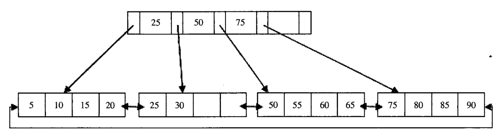
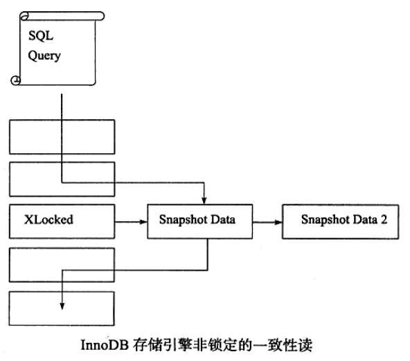

# 知识碎片记录

[toc]

## JAVA基础知识

### 1、Stream流

#### (1) List排序:sort

 ```java
List<ImprovedReportedDto> returnList = new ArrayList<>();

//根据ImprovedReportedDto的cur进行排序，默认升序
returnList.stream()
    .sorted(Comparator.comparing(ImprovedReportedDto::getCur))
    .collect(Collectors.toList());

//根据ImprovedReportedDto的cur进行倒序排序
returnList.stream()
    .sorted(Comparator.comparing(ImprovedReportedDto::getCur).reversed())
    .collect(Collectors.toList());
 ```

#### (2) List分组:collect

```java
public static void main(String[] args) {

   	//创建对象增加到list中
    ArrayList<OrderAddVo> list = new ArrayList<>();
    for (int i = 0; i < 5; i++) {
        OrderAddVo orderAddVo = new OrderAddVo();
        if (i < 2) {
            orderAddVo.setShopId(i + "");
        } else {
            orderAddVo.setShopId("5");
        }
        list.add(orderAddVo);
    }

    //将list中的对象，如果shopId相同则分为一组，并且为这一组对象生成同一个订单
    Random random = new Random();
    list.stream().collect(Collectors.groupingBy(OrderAddVo::getShopId)).forEach(new BiConsumer<String, List<OrderAddVo>>() {
        @Override
        public void accept(String shopId, List<OrderAddVo> list) {
            String orderNumber = "2" + System.currentTimeMillis() + Math.abs(random.nextInt() % 1000000);
            list.forEach(orderAddVo -> orderAddVo.setOrderNumber(orderNumber));
        }
    });
}
```

#### (3) mapToInt

```java
//mapToInt之后返回的InputStream不支持collect(Collects.toList())
list.stream().mapToInt(orderAddVo -> Integer.parseInt(orderAddVo.getSkuId())).collect(Collectors.toList());
//应该改为map代替，如下写法
List<Integer> skuIdList = list.stream().map(orderAddVo -> Integer.parseInt(orderAddVo.getSkuId())).collect(Collectors.toList());
```

## Mysql

### 1、SQL语句

#### (1) 常见问题

##### 问题一：concat拼接函数为null

当concat拼接的的字段有一个为null是，其结果jiuweinull，如下

```sql
SELECT CONCAT('1,',NULL,'2');
结果为：NULL
```

###### 解决方法一

```sql
SELECT CONCAT('1,',IFNULL(NULL,''),'2');
执行结果：1,2
```

###### 解决方法二

```sql
SELECT CONCAT_WS(',','1',NULL,'2'); 指定使用逗号进行分隔
执行结果：1,2
```

###### concat_ws语法：

```sql
CONCAT_WS(分隔符，参数1，参数2，...参数n)
```

##### 问题二：根据select结果集更新数据

根据查询结果更新设备的经纬度

```sql
UPDATE Device AS d
INNER JOIN (
	SELECT
		Device.SckQRCode,
		Device.siteID,
		site.longitude,
		site.latitude 
	FROM
		Device LEFT JOIN site ON Device.siteID = site.siteID 
	WHERE
		Device.latitude IS NULL 
		OR Device.longitude IS NULL 
) AS s 
ON d.SckQRCode = s.SckQRCode 
SET d.longitude = s.longitude,d.latitude = s.latitude;
```

#### (2) Explain

##### 各项参数解释

```
id:每个select子句的标识id
select_type:select语句的类型
table:当前表名
partitions:显示查询将访问的分区，如果你的查询是基于分区表
type：当前表内访问方式
possible_keys:可能使用到的索引
key:经过优化器评估最终使用的索引
key_length:使用到的索引长度
ref:引用到的上一个表的列
rows:rows_examined，要得到最终记录索要扫描经过的记录数
filtered:存储引擎返回的数据在server层过滤后，剩下多少满足查询的记录数量的比例，注意是百分比，不是记录数。
Extra:额外的信息说明
```

##### 优化

###### extra为Using filesort

```
当select中包含 ORDER BY 操作，而且无法利用索引完成排序操作的时候。MySQL Query Optimizer 不得不选择相应的排序算法来实现。数据较少时从内存排序，否则从磁盘排序。Explain不会显示的告诉客户端用哪种排序。官方解释：“MySQL需要额外的一次传递，以找出如何按排序顺序检索行。通过根据联接类型浏览所有行并为所有匹配WHERE子句的行保存排序关键字和行的指针来完成排序。然后关键字被排序，并按排序顺序检索行”

举例：按照时间排序，可以改为按照自增主键排序。
```


### 3、慢查询日志

#### (1) 查询是否开启慢查询日志及慢查询日志位置

```
mysql> show variables like 'slow_query%';
+---------------------+-----------------------------------------+
| Variable_name       | Value                                   |
+---------------------+-----------------------------------------+
| slow_query_log      | OFF                                     |
| slow_query_log_file | /data/mysql/data/10-46-134-131-slow.log |
+---------------------+-----------------------------------------+
```

#### (2) 查询慢查询日志阀值时间

```
mysql> show variables like 'long_query_time';
+-----------------+-----------+
| Variable_name   | Value     |
+-----------------+-----------+
| long_query_time | 10.000000 |
+-----------------+-----------+
```

#### (3) 查询慢查询日志输出方式

```
mysql> show variables like '%log_output%';
+---------------+-------+
| Variable_name | Value |
+---------------+-------+
| log_output    | FILE  |
+---------------+-------+
```

### 4、索引

#### (1) 定义

```
索引(在MySQL中也叫作“键(key)”)是存储引擎用户快速查找记录的一种数据结构。
```

#### (2) 类型

- 普通索引：最基本的索引，它没有任何限制，用于加速查询。
- 唯一索引：索引列的值必须唯一，但允许有空值。如果是组合索引，则列值的组合必须唯一。
- 主键索引：是一种特殊的唯一索引，一个表只能有一个主键，不允许有空值。
- 组合索引：多个字段上创建的索引。使用组合索引时遵循最左前缀集合。

#### (3) InnoDB 存储引擎

##### 数据页

```mysql
SHOW GLOBAL STATUS like 'Innodb_page_size';
```

```
存储引擎负责对表中的数据的进行读取和写入，常用的存储引擎有InnoDB、MyISAM、Memory等，不同的存储引擎有自己的特性，数据在不同存储引擎中存放的格式也是不同的，比如Memory都不用磁盘来存储数据。

在InnoDB中，数据会存储到磁盘上，在真正处理数据时需要先将数据加载到内存，表中读取某些记录时，InnoDB存储引擎不需要一条一条的把记录从磁盘上读出来，InnoDB采取的方式是：将数据划分为若干个页，以页作为磁盘和内存之间交互的基本单位，InnoDB中页的大小一般为16 KB，也就是说，当需要从磁盘中读数据时每一次最少将从磁盘中读取16KB的内容到内存中，每一次最少也会把内存中的16KB内容写到磁盘中。

按照LRU算法来保留在缓冲池中的缓存数据。如果数据库文件需要修改，总是先修改在缓存池中的页(发生修改后，改页即为脏页),然后再按照一定的频率将缓冲池的脏也刷新到文件。
```

InnoDB存储引擎支持两种常见的索引，**B+树索引**和**哈希索引**。

 ##### Hash索引

```
InnoDB存储引擎会监控表上索引的查找，如果观察到建立哈希索引可以带来速度的提升，则建立哈希索引，所以称之为自适应的。自适应哈希索引通过缓冲池的B+树构造而来，因此建立的速度很快。而且不需要将整个表都建哈希索引，InnoDB存储引擎会自动根据访问的频率和模式来为默写页建立哈希索引。
```

##### B+树索引

```
B+树为:平衡的多路查找树,其中B为(Balance)。下图为4阶B+树：
```



```
InnoDB实现的B+树索引是聚集索引，所有的数据都存放在叶子节点，而非叶子节点只存在冗余的索引。
并且叶子节点之间采用双向链表链接，便于进行范围查询。
```

```
一个常被忽略的问题是:B+树索引并不能找到一个给定键值的具体行。B+树索引能找到的只是被查找行所在的页。然后数据库把页读入内存，再在内存中进行查找，最后得到查找的数据。
```

### 4、事务

#### (1) 事务隔离级别

- `READ-UNCOMMITTED`（读未提交）       ---  脏读
- `READ-COMMITTED`（读已提交）           --- 不可重复读
- `REPEATABLE-RAD`（可重复读）           ---  幻度
- `SERIALIZABLE`（串行化）

在`READ-COMMITTED`事务隔离级别下，会始终读取数据的最新版本。

在`REPEATABLE-RAD`事务隔离级别下，会读取事务开始的版本的数据。

### 5、锁

#### (1) 锁的类型

- 共享锁（S Lock），允许事务读一行数据。
- 排它锁（X Lock），允许事务删除或更新一行数据。

如果一个事务T1已经获得了行r的共享锁，那么另外的事务T2可以立即获得行r的共享锁，因为读取并没有改变行r的数据，称这种情况为锁兼容（Lock Compatible）。但若有其他的事务T3想获得行r的排它锁，则必须等待事务T1、T2释放行r上的共享锁——这种情况称为锁不兼容。下表显示了共享锁和排它锁的兼容性。

|      |   X    |   S    |
| :--: | :----: | :----: |
|  X   | 不兼容 | 不兼容 |
|  S   | 不兼容 |  兼容  |

#### (2) 一致性非锁定读

​		一致性非锁定读是指InnoDB存储引擎通过多版本控制的方式来读取当前执行时间数据库中行的数据。如果读取的行正在执行DELETE或UPDATE操作，这是读取操作不会因此区等待行上的锁的释放。相反的，InnoDB会去读取行的快照数据。如图所示：



​		这是InnoDB默认的读取方式，即读取不会占用和等待表上的锁。但是在不同的事务隔离级别下，读取的方式不同，并不是在每个事物隔离级别下都是采用非锁定的一致性读。此外，即使都是采用非锁定的一致性读，但是对应快照数据的定义也各不相同。

​		快照数据其实就是当前数据之前的历史版本，每行记录可能有多个版本。如上图所示，一个行记录可能有不止一个快照数据，一般称这种技术为**`行多版本技术`**。由此带来的并发控制，称之为**`多版本并发控制（Multi Version Concurrent Control）`**。

​		在事务隔离级别`READ-COMMITTED`和`REPEATABLE-READ`下，InnoDB存储引擎使用非锁定的一致性读。然而，对于快照数据的定义却不相同。在`READ-COMMITTED`事务隔离级别下，对应快照数据，非一致性读总是读取被锁定行最新一份快照数据。而在`REPEATABLE-READ`事务隔离级别下，对应快照数据，非一致性读总是读取事务开始时的行数据版本。

```sql
mysql> select @@tx_isolation;
+-----------------+
| @@tx_isolation  |
+-----------------+
| REPEATABLE-READ |
+-----------------+
1 row in set (0.06 sec)

mysql> begin;
Query OK, 0 rows affected (0.04 sec)

mysql> update shop set shop_name = 'cwp' where shop_id = 1;
Query OK, 1 row affected (0.04 sec)
Rows matched: 1  Changed: 1  Warnings: 0

mysql> select * from shop;
+---------+-----------+-----------+
| shop_id | shop_name | ship_addr |
+---------+-----------+-----------+
|       1 | cwp       | 广东广州  |
+---------+-----------+-----------+
1 row in set (0.06 sec)

mysql> commit;
Query OK, 0 rows affected (0.04 sec)

mysql> 
```

```sql
mysql> select @@tx_isolation;
+-----------------+
| @@tx_isolation  |
+-----------------+
| REPEATABLE-READ |
+-----------------+
1 row in set (0.06 sec)

mysql> begin;
Query OK, 0 rows affected (0.04 sec)

mysql> select * from shop; --第一次查询信息
+---------+-----------+-----------+
| shop_id | shop_name | ship_addr |
+---------+-----------+-----------+
|       1 | SSS       | 广东广州  |
+---------+-----------+-----------+
1 row in set (0.07 sec)

mysql> select * from shop; --当上面会话中的事务中的更新操作执行后查询结果
+---------+-----------+-----------+
| shop_id | shop_name | ship_addr |
+---------+-----------+-----------+
|       1 | SSS       | 广东广州  |
+---------+-----------+-----------+
1 row in set (0.06 sec)

mysql> select * from shop; --当上面会话中的事务commit查询结果
+---------+-----------+-----------+
| shop_id | shop_name | ship_addr |
+---------+-----------+-----------+
|       1 | SSS       | 广东广州  |
+---------+-----------+-----------+
1 row in set (0.06 sec)

mysql> commit;
Query OK, 0 rows affected (0.04 sec)

mysql> select * from shop; --当本会话中的事务commit查询结果
+---------+-----------+-----------+
| shop_id | shop_name | ship_addr |
+---------+-----------+-----------+
|       1 | cwp       | 广东广州  |
+---------+-----------+-----------+
1 row in set (0.07 sec)

mysql> 
```

## SpringBoot

### 1、线程池

- 继承ThreadPoolTaskExecutor，在父类的基础上加入了日志信息，查看线程池的信息

```java
/**
 * @Description : ThreadPoolTaskExecutor的子类，在父类的基础上加入了日志信息，查看线程池的信息
 * @Date : 2020-3-17 16:12:48
 */
public class VisiableThreadPoolTaskExecutor extends ThreadPoolTaskExecutor {
    private static final Logger logger = LoggerFactory.getLogger(VisiableThreadPoolTaskExecutor.class);

    private void showThreadPoolInfo(String prefix){
        ThreadPoolExecutor threadPoolExecutor = getThreadPoolExecutor();

        logger.info("{}, {},taskCount [{}], completedTaskCount [{}], activeCount [{}], queueSize [{}]",
                this.getThreadNamePrefix(),
                prefix,
                threadPoolExecutor.getTaskCount(),
                threadPoolExecutor.getCompletedTaskCount(),
                threadPoolExecutor.getActiveCount(),
                threadPoolExecutor.getQueue().size());
    }

    @Override
    public void execute(Runnable task) {
        showThreadPoolInfo("1. do execute");
        super.execute(task);
    }

    @Override
    public void execute(Runnable task, long startTimeout) {
        showThreadPoolInfo("2. do execute");
        super.execute(task, startTimeout);
    }

    @Override
    public Future<?> submit(Runnable task) {
        showThreadPoolInfo("1. do submit");
        return super.submit(task);
    }

    @Override
    public <T> Future<T> submit(Callable<T> task) {
        showThreadPoolInfo("2. do submit");
        return super.submit(task);
    }

    @Override
    public ListenableFuture<?> submitListenable(Runnable task) {
        showThreadPoolInfo("1. do submitListenable");
        return super.submitListenable(task);
    }

    @Override
    public <T> ListenableFuture<T> submitListenable(Callable<T> task) {
        showThreadPoolInfo("2. do submitListenable");
        return super.submitListenable(task);
    }
}
```

- 通过配置类的方式来创建一个线程池

```java
@Configuration
@EnableAsync
public class ExecutorConfig {

    private static final Logger logger = LoggerFactory.getLogger(ExecutorConfig.class);

    @Bean
    public Executor asyncServiceExecutor() {
        logger.info("start asyncServiceExecutor");
        //ThreadPoolTaskExecutor executor = new ThreadPoolTaskExecutor();
        ThreadPoolTaskExecutor executor = new VisiableThreadPoolTaskExecutor();
        //配置核心线程数
        executor.setCorePoolSize(5);
        //配置最大线程数
        executor.setMaxPoolSize(20);
        //配置队列大小
        executor.setQueueCapacity(10000);
        //配置线程池中的线程的名称前缀
        executor.setThreadNamePrefix("async-service-");

        // rejection-policy：当pool已经达到max size的时候，如何处理新任务
        // CALLER_RUNS：不在新线程中执行任务，而是有调用者所在的线程来执行
        executor.setRejectedExecutionHandler(new ThreadPoolExecutor.CallerRunsPolicy());
        //执行初始化
        executor.initialize();
        return executor;
    }
}
```

- 在需要执行的异步操作的方法上加入@Async注解，值为@Bean对应的方法名

```java
@Service
public class AsyncAddDBService {
    private static final Logger logger = LoggerFactory.getLogger(AsyncAddDBService.class);

    @Autowired
    private AlarmInfoMapper alarmInfoMapper;
    @Autowired
    private SmsAndOrderService smsAndOrderService;

     /*
        无论成功失败都要进入短信-工单流程
        失败进去转工单时会给该工单一个特殊的状态，以便标识
      */
    @Async("asyncServiceExecutor")
    public void executeAsync(AlarmInfoDto alarmInfoDto){
        alarmInfoDto.setEqptSn(querySnByImei(alarmInfoDto.getImei()));
        Integer row = alarmInfoMapper.addInfo(alarmInfoDto);
        if(null != row && row != 0){
            CacheUtil.remove(alarmInfoDto.getImei());
            smsAndOrderService.handleInfo(alarmInfoDto,true);
        }else{
            logger.error("异步保存数据到数据库失败>> {}",alarmInfoDto.toString());
            smsAndOrderService.handleInfo(alarmInfoDto,false);
        }
    }

    //查询SN号
    private String querySnByImei(String imei){
        return alarmInfoMapper.querySnByImei(imei);
    }
}
```


## Mybatis

### 1、Mybatis结果映射为`List<String>`

#### (1) 结果集对象

```java
package com.yjzn.customization.dto.customization;

import lombok.Getter;
import lombok.Setter;
import lombok.ToString;
import java.util.List;

/**
 * @author 陈伟平
 * @date 2020-1-19 15:15:12
 */
@ToString
@Getter
@Setter
public class AdminQueryDto {
    private List<String> roleId;
    private List<String> privilegeId;
    private List<String> routerTree;
}
```

#### (2) xml映射文件

```mysql
<select id="queryInfo" resultMap="queryInfoMap" parameterType="AdminQueryVo">
    select 
        ar.role_id,
        rp.privilege_id,
        r.router_tree
    from administrator as a1
    left join administrator as a2 on a1.parent_id = a2.admin_id
    left join admin_role as ar  on a1.admin_id=ar.admin_id
    left join role as r on ar.role_id=r.role_id
    left join role_privilege as rp on ar.role_id=rp.role_id
    <where>
        <if test="adminId!=null and adminId!=''">
            a1.admin_id=#{adminId}
        </if>
        <if test="parentId!=null and parentId!=''">
            a1.parent_id=#{parentId}
        </if>
        <if test="phone!=null and phone!=''">
            a1.phone=#{phone}
        </if>
    </where>
    order by a1.add_time desc
</select>

<resultMap id="queryInfoMap" type=".AdminQueryDto">
    <collection property="roleId" ofType="java.lang.String">
        <constructor>
        	<arg column="role_id"/>
        </constructor>
    </collection>
    <collection property="privilegeId" ofType="java.lang.String">
        <constructor>
        	<arg column="privilege_id"/>
        </constructor>
    </collection>
    <collection property="routerTree" ofType="java.lang.String">
        <constructor>
        	<arg column="router_tree"/>
        </constructor>
    </collection>
</resultMap>
```

#### (3) 解释说明

```cwp
可以通过collection中constructor来实现将结果集映射为list，其中collection的ofType属性为list中参数类型
```

 ## Git

### 1、修改远程仓库地址

将项目从原来的仓库改为另一个仓库

- git remote rm origin

- git remote add origin 远程仓库地址

  